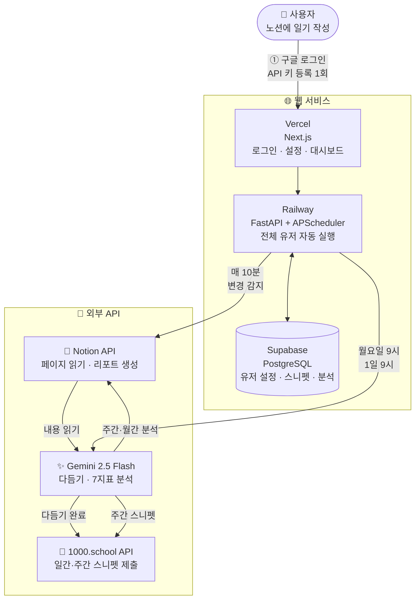
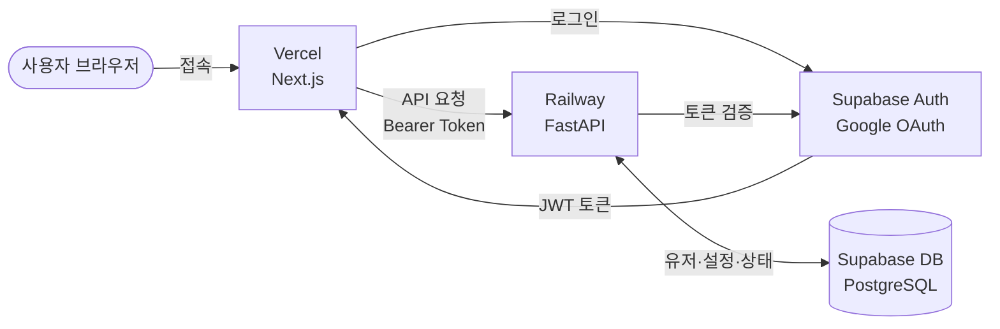
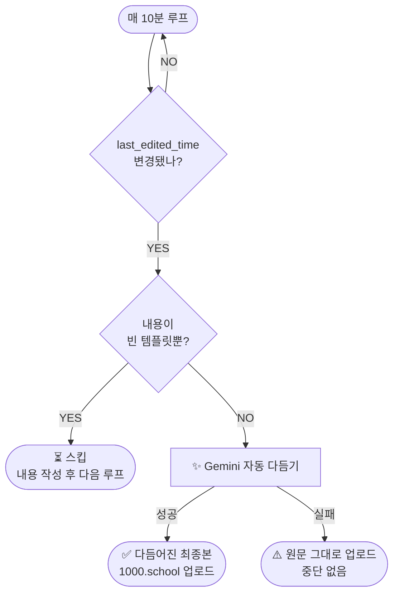
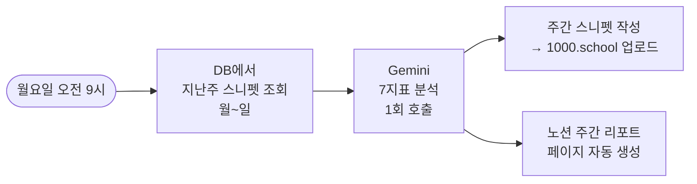

# 📓 Daily Snippet Automation

> 노션에 일기를 쓰면, AI가 자동으로 정형화해서 1000.school에 제출합니다.
> 매주·매달 AI 감독이 패턴을 분석해 리포트를 생성합니다.

---

## 왜 만들었나

**Daily Snippet을 쓰는 건 좋은데, 매일 형식에 맞게 정리해서 올리는 게 번거롭다.**

```
기존 흐름
  노션에 오늘 한 일 메모
      → 형식에 맞게 직접 다듬기
          → 1000.school에 복붙
              → 저장

문제점
  - 하루도 빠짐없이 반복되는 단순 작업
  - 일상 기록을 노션에다가 단순히 기록하지만 스니펫에 따로 작성해야함.
  - 기존 AI제안이 과대 해석하는 경향이 있음
  - 바쁜 날은 건너뛰게 됨
  - 주간 스니펫 일주일치 회고를 따로 써야 함
```

**→ 노션에 메모만 해두면 나머지는 전부 자동으로 처리되게 만들었다.**

---

## 한 줄 요약

**노션 작성 → AI 자동 제안 → 1000.school 자동 제출 → 주간·월간 AI 감독 리포트**

---

## 전체 서비스 구조



---

## 웹 서비스 구성



| 구성 | 역할 |
|------|------|
| **Vercel (Next.js)** | 로그인·설정·대시보드 UI |
| **Railway (FastAPI)** | API 서버 + APScheduler (10분마다 전체 유저 순회) |
| **Supabase Auth** | Google OAuth 로그인, JWT 세션 관리 |
| **Supabase DB** | 유저 설정 (API 키 암호화), 스니펫, 분석 결과 저장 |
| **Notion API** | 페이지 변경 감지, 리포트 페이지 자동 생성 |
| **1000.school API** | 일간·주간 스니펫 자동 제출 |
| **Gemini 2.5 Flash** | 스니펫 AI 제안 + 주간·월간 AI 분석 |

---

## 기술 스택

| 분류 | 기술 |
|------|------|
| 백엔드 | Python 3.12 · FastAPI · APScheduler |
| 프론트엔드 | Next.js 14 · TypeScript |
| 데이터베이스 | Supabase (PostgreSQL) · SQLite (로컬) |
| AI | Google Gemini 2.5 Flash |
| 배포 | Vercel · Railway |
| 외부 API | Notion API · 1000.school API |

---

## 핵심 기능

### 1. 자동 변경 감지 & AI 제안 업로드

노션 페이지의 `last_edited_time`을 **10분마다** 확인합니다.
변경이 감지되면 **Gemini AI가 즉시 내용을 다듬어** 1000.school에 제출합니다.



> 노션에 저장할 때마다 자동으로 다듬어 제출되므로, 별도 버튼이나 트리거가 필요 없습니다.

**AI 제안 전/후 예시**

| | 내용 |
|--|------|
| **원문** (노션 메모) | `회의 했음. API 연동. 책 읽음.` |
| **AI 제안 후** (1000.school 제출) | 아래 참고 ↓ |

```
## 오늘 한 일
- 팀 회의 참여 (주요 안건 논의 및 역할 분담 완료)
- NotionAPI 연동 작업 (스니펫 자동 업로드 흐름 설계)
- 파타고니아 인사이드 독서 (120p까지)

## 수행 목적
- 팀 방향성 재정렬 및 이번 주 우선순위 확정
- 자동화로 반복 작업 제거, 기록 품질 향상

## 하이라이트
- API 연동 구조 설계 완료로 다음 단계 구현이 명확해짐

## 로우라이트
- 회의 시간이 길어져 개인 작업 시간 부족

## 내일의 우선순위
- NotionAPI: 스니펫 업로드 엔드포인트 구현 완료

## 팀 기여
- 역할 분담 조율 → 팀 병렬 작업 가능 상태로 전환

## 헬스 체크 (10점)
- 7/10 (전반적으로 양호)
```

---

### 2. 주간 리포트 (매주 월요일 오전 9시 자동)

지난주(월~일) 일간 스니펫을 DB에서 꺼내 분석합니다.



**노션 자동 생성 구조**

```
Daily Snippet (부모 페이지)
├─ 2026-03                   ← 월별 컨테이너 (자동 생성)
│   ├─ 2026-03-22
│   └─ 2026-03-23
├─ 📅 주간 리포트
│   ├─ W12 (03/16~03/22)     ← 매주 새 페이지 자동 생성
│   └─ W13 (03/23~03/29)
└─ 📆 월간 리포트
    ├─ 2026-03 (3월)          ← 매달 새 페이지 자동 생성
    └─ 2026-04 (4월)
```

> 부모 페이지만 연결해두면 모든 하위 페이지는 자동으로 생성됩니다.

---

### 3. 7대 AI 감독 지표

매주·매달 스니펫 전체를 분석해 7가지 지표로 평가합니다.

| 지표 | 무엇을 보나 | 높으면 |
|------|------------|--------|
| 🔥 번아웃 위험도 | 헬스 점수 저하, 피로 패턴 반복 | 위험 ⚠️ |
| 👥 팀 건강도 | 팀 기여 빈도, 갈등 조짐 | 좋음 ✅ |
| 💪 성실도 | 작성 연속성, 우선순위 달성률 | 좋음 ✅ |
| 🔁 문제 재발성 | 동일 로우라이트 반복 여부 | 재발 많음 ⚠️ |
| 🧠 성장 지수 | 새 학습, 피드백 이행 여부 | 좋음 ✅ |
| ⚡ 실행 집중도 | 목표와 실제 행동 일치도 | 좋음 ✅ |
| 💬 감정 에너지 | 글의 긍정도, 자기효능감 변화 | 긍정적 ✅ |

**토큰 절약 구조 (Gemini 과금 최소화)**

```
스니펫 원문 전체 (~1,000자/일 × N일)
    │  직접 보내면 토큰 폭발 💥
    ▼
DB에서 핵심 필드만 추출·압축
    날짜 | 헬스 | 하이라이트 요약 | 로우라이트 | 내일 목표
    2026-03-19 | 6/10 | API 연동 성공 | 재시험 아쉬움 | API 마무리
    │
    ▼  (~100자/일로 압축) → Gemini 전송 → 7지표 분석
```

---

### 4. 매일 오전 9시 자동 페이지 생성

오전 9시가 지나면 오늘 날짜 노션 페이지를 자동으로 만들어줍니다.

```
오전 9:00
    │
    ├─ 오늘 날짜 페이지 이미 있음? → 스킵
    └─ 없음 → 월별 컨테이너 안에 템플릿 포함 새 페이지 자동 생성
                ## What  /  ## Why  /  ## Team Value Added
                ## Highlight  /  ## Lowlight  /  ## Tomorrow
```

**날짜 기준 (KST 오전 9시)**

```
8:59 ─────────── 9:00
  │                │
어제 날짜 기준    오늘 날짜 기준
(어제 페이지)    (오늘 페이지 생성)
```

---

## 자동화 스케줄 요약

| 시점 | 동작 | 조건 |
|------|------|------|
| **매 10분** | 노션 변경 여부 확인 | 항상 |
| **변경 감지 시** | Gemini 다듬기 → 1000.school 일간 스니펫 업로드 | 내용 있을 때만 |
| **매일 오전 9시** | 오늘 날짜 노션 페이지 자동 생성 | 없는 경우만 |
| **매주 월요일 오전 9시** | 지난주 주간 리포트 (노션) + 주간 스니펫 (1000.school) | 자동 |
| **매달 1일 오전 9시** | 지난달 월간 리포트 (노션) | 자동 |
| **페이지 생성 실패** | 10분 후 자동 재시도 | 에러 복구 |

---

## 데이터 저장 구조 (SQLite / Supabase)

```
snippets 테이블 (날짜별 1행)
┌──────────┬───────────┬────────────┬─────────────┬────────────┐
│   date   │  content  │health_score│  highlights │  lowlights │ ...
├──────────┼───────────┼────────────┼─────────────┼────────────┤
│2026-03-19│ (전체원문)│    6.0     │ API 연동 성공│ 재시험 아쉬│
│2026-03-18│ (전체원문)│    5.0     │ ...         │ ...        │
└──────────┴───────────┴────────────┴─────────────┴────────────┘
  ↑ 1000.school에서 동기화한 스니펫 원문
  ↑ highlights, lowlights 등은 content에서 섹션 파싱해 추출

analysis 테이블 (리포트 실행마다 누적)
┌────────────┬──────────────┬───────────┬────────────┬─────────┐
│ created_at │snippet_count │burnout_risk│ team_health│ growth  │ ...
├────────────┼──────────────┼───────────┼────────────┼─────────┤
│2026-03-23  │      7       │    35     │     80     │   70    │
│2026-04-01  │     30       │    40     │     75     │   82    │
└────────────┴──────────────┴───────────┴────────────┴─────────┘
```

---

## 파일 구조

```
notion-school-sync/
│
├── main.py            ← 핵심 실행 파일
│                         변경 감지, Gemini polish, 스니펫 업로드, 페이지 생성
│
├── report.py          ← AI 감독 리포트 생성
│                         주간·월간 리포트 (노션) + 주간 스니펫 (1000.school)
│
├── db.py              ← DB 어댑터 (SQLite ↔ Supabase 자동 전환)
│                         스니펫 저장·조회, 섹션 추출, 달성률 계산
│
├── backend/           ← FastAPI 서버 (멀티유저 웹 서비스)
│   └── app/
│       ├── main.py          ← API 라우터, CORS
│       ├── scheduler.py     ← APScheduler (전체 유저 10분 순회)
│       ├── legacy_runner.py ← main.py·report.py subprocess 실행
│       ├── auth.py          ← Supabase JWT 검증
│       └── security.py      ← API 키 AES 암호화
│
├── web/               ← Next.js 프론트엔드
│   └── app/
│       ├── login/     ← 구글 로그인
│       ├── dashboard/ ← 동작 상태 확인
│       └── settings/  ← API 키 입력
│
├── requirements.txt   ← 버전 고정 패키지 목록
├── .env.example       ← 환경 변수 템플릿 (복사해서 .env 만들기)
├── setup.sh           ← 클론 후 한 번에 세팅하는 스크립트
└── .env               ← 실제 API 키 (비공개, git 제외)
```

---

## 시작하기

### 웹 서비스 사용 (권장)

1. 웹 접속 → 구글 로그인
2. Settings 페이지에서 API 키 입력
   - Notion Integration 토큰
   - Notion 부모 페이지 ID
   - 1000.school API 키
   - Gemini API 키 (무료: [aistudio.google.com](https://aistudio.google.com/app/apikey))
3. 완료 → 이후 자동 실행

---

### 로컬 실행 (개인)

```bash
# 1. 클론
git clone https://github.com/leten02/notion-school-sync.git
cd notion-school-sync

# 2. 자동 세팅 (가상환경 + 패키지 + DB 초기화 한 번에)
bash setup.sh

# 3. .env 파일에 API 키 입력
cp .env.example .env
nano .env
```

세팅 완료 후 실행:
```bash
source venv/bin/activate
python main.py --watch   # 이것만 켜두면 전부 자동
```

---

### 환경 변수 설정

```env
NOTION_TOKEN=secret_xxxx       # 노션 Integration 토큰
NOTION_PAGE_ID=xxxx            # 데일리 페이지 부모 페이지 ID
SCHOOL_API_KEY=I_wrdo_xxxx     # 1000.school API 키
GEMINI_API_KEY=AIzaSy_xxxx     # Gemini API 키
```

**NOTION_PAGE_ID 찾는 방법**
```
노션 부모 페이지 열기
→ 주소창: notion.so/abc123def456ghi789...
→ 마지막 32자리가 PAGE_ID (하이픈 없이 입력)
```

**노션 Integration 연결 방법**
1. [notion.so/my-integrations](https://www.notion.so/my-integrations) → Integration 생성
2. 부모 페이지 우측 상단 `···` → **연결** → 생성한 Integration 선택

**Gemini API 키 발급 (무료)**
- [aistudio.google.com/app/apikey](https://aistudio.google.com/app/apikey)

---

### 실행 명령어

```bash
# ✅ 메인: Watch 모드 (이것만 켜두면 전부 자동)
python main.py --watch

# 백그라운드 실행 (터미널 꺼도 유지)
nohup python main.py --watch > watch.log 2>&1 &

# 실행 중인지 확인
ps aux | grep main.py

# 종료
kill $(ps aux | grep 'main.py --watch' | grep -v grep | awk '{print $2}')

# 리포트 수동 즉시 생성 (watch와 별도 터미널에서)
python report.py

# 오늘 템플릿 수동 추가
python main.py --template
```
